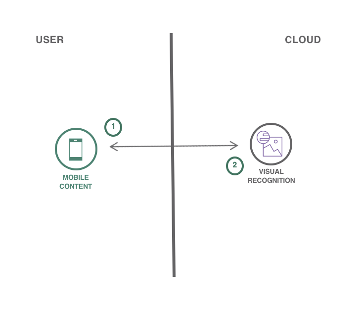
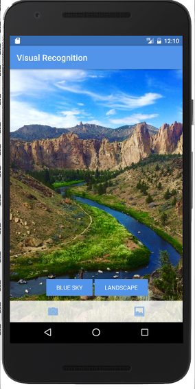
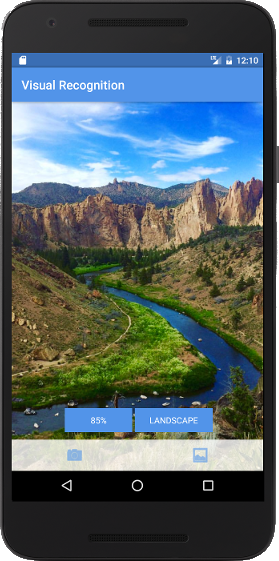

# Create an Android application in Java which uses image recognition

> We have a similar pattern available for [iOS](https://github.com/IBM/visual-recognition-ios), as well!

In this code pattern, you will create an Android app that showcases computer vision by labeling what the device's camera sees. You will provision a Visual Recognition service where you can either leverage a demo model or train your own custom model.

When you have completed this code pattern, you will understand how to:

* Customize Watson Visual Recognition for your unique use case
* View the labels related to a picture and the estimated accuracy of that label

## Steps

> As an alternative to steps 1 & 2 below, you can [create this project as a starter kit](https://console.bluemix.net/developer/appservice/create-app?defaultDeploymentToolchain=&defaultLanguage=SPRING&env_id=ibm%3Ayp%3Aus-south&navMode=catalog&starterKit=827c8244-3d95-3fff-b2bd-0841b587d297) on IBM Cloud, which automatically provisions required services, and injects service credentials into a custom fork of this pattern. Then, you can skip directly to step 3 below.

1. [Install development dependencies](#1-install-development-dependencies)
1. [Configure service credentials](#2-configure-service-credentials)
1. [Run](#3-run)

### 1. Install development dependencies

Ensure you have the following development tools installed:

* [Android Studio](https://developer.android.com/studio/index.html)
* [Gradle](https://gradle.org/gradle-download/)

### 2. Configure service credentials

Open this project in Android Studio and perform a Gradle Sync.

Use the [IBM Cloud Catalog](https://console.bluemix.net/catalog/) to [create a Visual Recognition service instance](https://console.bluemix.net/catalog/services/visual-recognition) on the Lite plan.

When the service has been created, navigate to the **Service credentials** tab, and create a **New credential ⊕** with the default options. Click **View credentials**. Edit `app/src/main/res/values/credentials.xml` in this project to configure your application with your own service credentials.

### 3. Run

You can now build and run the application from Android Studio.

 

The application allows you to perform Visual Recognition on user-selected images. You can take a photo from the application or select a photo from your gallery to start the Visual Recognition process. Tap the Tags to see the certainty score for the image.

## Troubleshooting

If you have problems getting the camera to work properly, make sure you have accepted appropriate permissions and are using the most up to date version of Google Play Services. You will need to re-create an emulator to pick up updates after downloading.

## License

[Apache 2.0](LICENSE)
